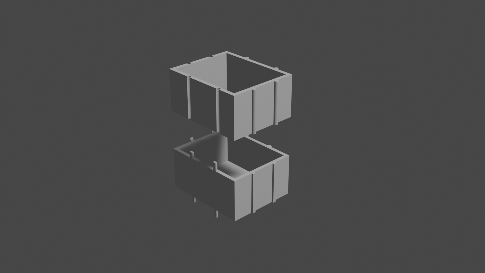

# Modelo de Organizadores Modulares para Blender

Este es un modelo de organizadores modulares completamente creado en Blender. Puedes usar este modelo para crear escenas de oficinas, almacenamiento, o cualquier otro entorno que requiera organizadores modulares.

---

## Contenido

- [Previsualización](#previsualización)
- [Instalación](#instalación)
- [Cómo Usar](#cómo-usar)
- [Créditos](#créditos)
- [Licencia](#licencia)

---

## Previsualización

---

## Instalación

1. Descarga el archivo de Blender del modelo desde el repositorio.
2. Abre Blender.
3. Ve a `Archivo -> Abrir`.
4. Navega hasta el archivo de Blender del modelo que descargaste.
5. Selecciona el archivo y haz clic en "Abrir".

---

## Cómo Usar

Una vez que hayas abierto el archivo en Blender, puedes realizar varias acciones:

- **Editar el Modelo**: Puedes modificar el modelo para adaptarlo a tus necesidades específicas, como cambiar la disposición de los módulos o agregar detalles adicionales.
- **Crear Escenas**: Utiliza el modelo para crear escenas de oficinas, almacenes u otros entornos donde se utilicen organizadores modulares.
- **Renderizado**: Experimenta con diferentes configuraciones de iluminación y materiales para obtener el aspecto deseado en tus renderizaciones.

---

## Créditos

Este modelo de Organizadores Modulares fue creado por [ferbc31](https://github.com/ferbc31). Asegúrate de dar crédito al autor si utilizas este modelo en tus proyectos.

---
